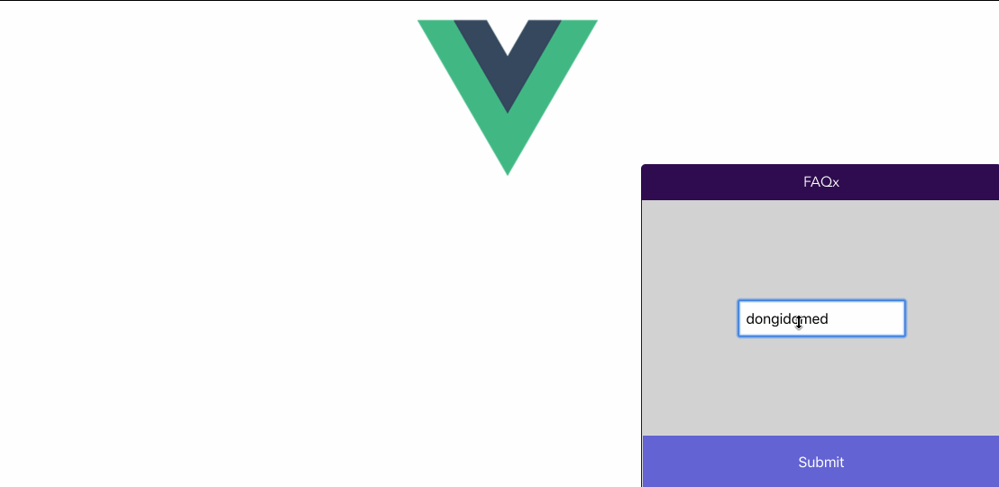

# Adding Chatbots to your GetStream chat app using Dialogflow

You can read more on how it was built [here](https://getstream.io/blog/adding-chatbots-to-your-stream-chat-app-using-googles-dialogflow/)


## Project setup
Clone the repository and install dependencies:

- clone the repository
```
git clone git@github.com:dongido001/getstream-chat-dialogflow-faq-bot.git
```

- change directory to the project directory
```
cd getstream-chat-dialogflow-faq-bot
```

- Install dependencies
```
npm install
```

- Create an environment keys

```
cp .env.exaple .env
```

- Update with your Getstream and Dialogflow Keys

```
VUE_APP_PORT=3000
VUE_APP_SERVER=http://localhost:3000

VUE_APP_KEY=<YOUR GETSTREAM CHAT KEY>
APP_SECRET=<YOUR GETSTREAM CHAT SECRET>

DIALOGFLOW_PROJECT_ID=<YOUR DIALOGFLOW PROJECT ID>
GOOGLE_APPLICATION_CREDENTIALS=<YOUR DIALOGFLOW SERVICE KEY FILE URL>
```
